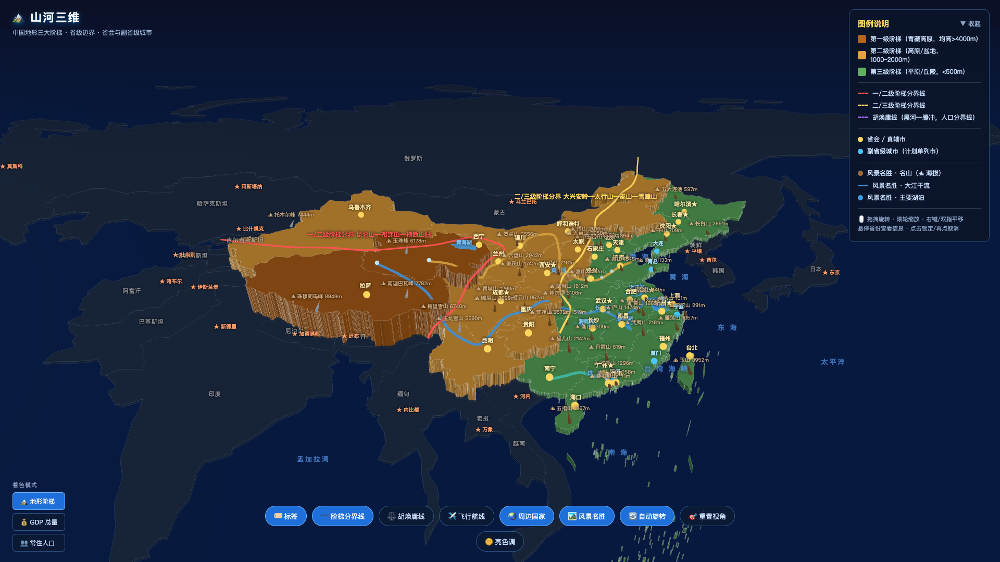
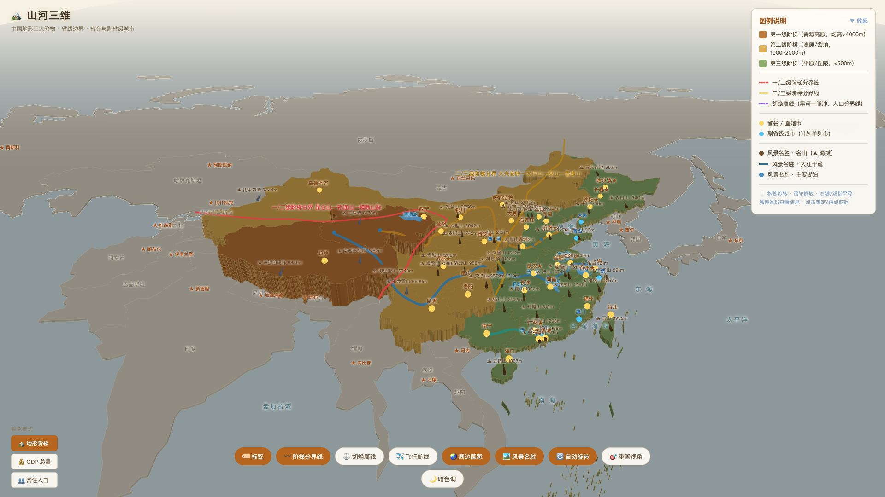

<div align="center">

# 🏔️ 山河三维 · 中国地形交互可视化

**基于 Three.js 的中国 3D 地形交互地图** —— 地形阶梯、省份经济、名山大川、水体动效，一切尽在浏览器中。



*暗色主题 · 默认视角*

</div>

## ✨ 功能特性

| 类别 | 内容 |
|------|------|
| 🗺️ **三大阶梯** | 34 个省级行政区按地形阶梯分色挤出，支持 GDP / 常住人口数据着色 |
| 📊 **完整经济数据** | 各省 2025 年 GDP、常住人口、省会，省内经济前三城市（含海拔） |
| 🌏 **周边国家** | 16 个邻国边界、首都标注，海域名称，世界地图视角 |
| ⛰️ **风景名胜** | 44 座名山（海拔标注）、长江/黄河/珠江、五大真实轮廓湖泊 |
| ✨ **水体动效** | 河流光点顺流而下、湖泊微波纹动画 |
| 📐 **专题线** | 三大阶梯分界线、胡焕庸线（黑河—腾冲） |
| 🛰️ **交互** | 悬停高亮、点击锁定/反选、省份详情面板、图层开关、明暗双主题、旋转/缩放/平移 |

## 🎨 明暗双主题

支持一键切换暗色与亮色（纸张地图风），偏好自动记忆。



*亮色主题 · 纸张地图风*

## 🚀 快速开始

直接打开 `index.html` 即可运行（需联网加载 three.js 与地图边界数据）。

```bash
# 本地预览
python3 -m http.server 8000
# 浏览器打开 http://localhost:8000
```

## 📁 目录结构

```
├── index.html        结构层
└── assets/
    ├── index.css     样式层
    ├── gdp.min.js    经济数据层（压缩版）
    ├── index.min.js  逻辑层（压缩混淆版）
    └── img/          展示截图
```

> 源码（`index.js` / `gdp.js`）与 sourcemap 仅保留在本地用于维护，未随公开仓库发布。

## 🖱️ 操作指引

- **左键拖拽**旋转 · **滚轮**缩放 · **右键/双指**平移
- **悬停**省份查看信息 · **点击**锁定 / 再点取消
- 底部控制栏切换图层与主题，左下角切换着色模式

## 📚 数据来源

- **地图边界**：阿里 DataV GeoAtlas、Natural Earth
- **经济数据**：各省统计局 2025 年统计公报、香港政府统计处、澳门统计暨普查局
- **海拔**：open-elevation

## 🛠️ 维护

修改 `assets/index.js` / `assets/gdp.js` 后重新压缩：

```bash
npx terser@5 assets/index.js --module -c -m --source-map "filename=assets/index.min.js.map,url=index.min.js.map" -o assets/index.min.js
npx terser@5 assets/gdp.js -c -m --source-map "filename=assets/gdp.min.js.map,url=gdp.min.js.map" -o assets/gdp.min.js
```